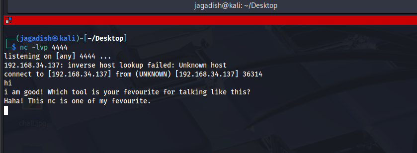
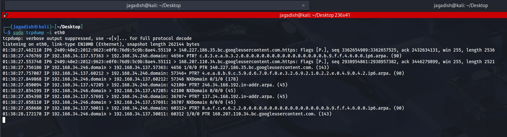
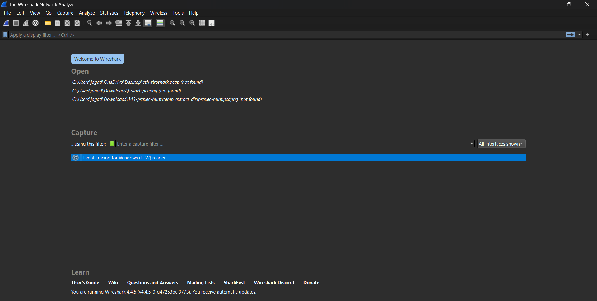
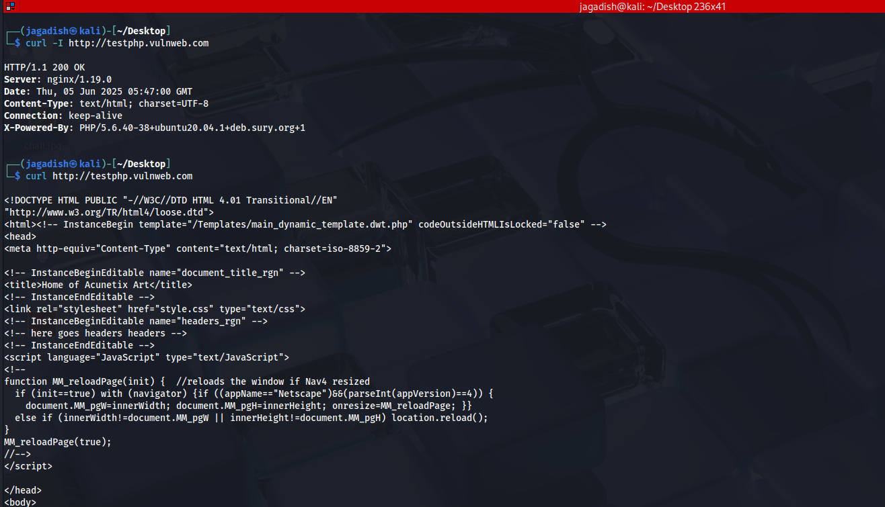
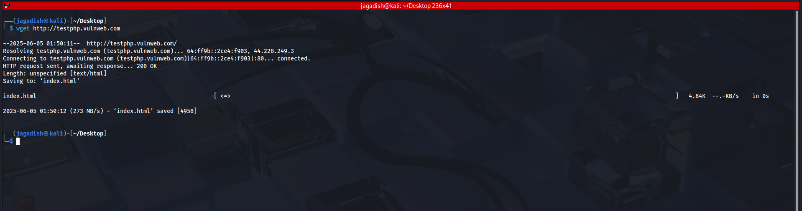
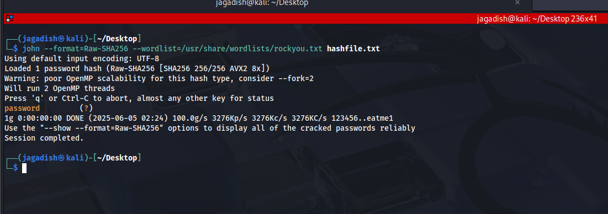
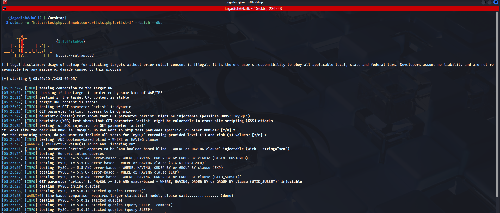
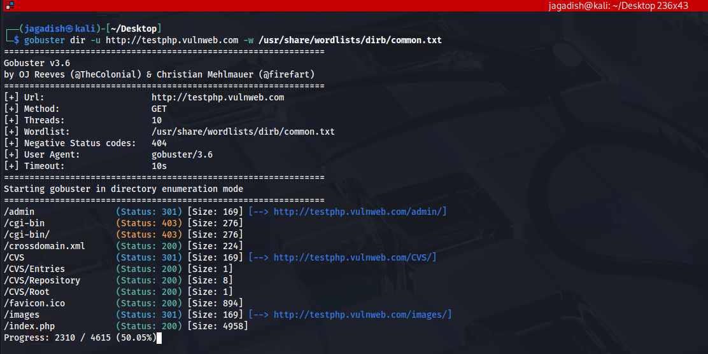
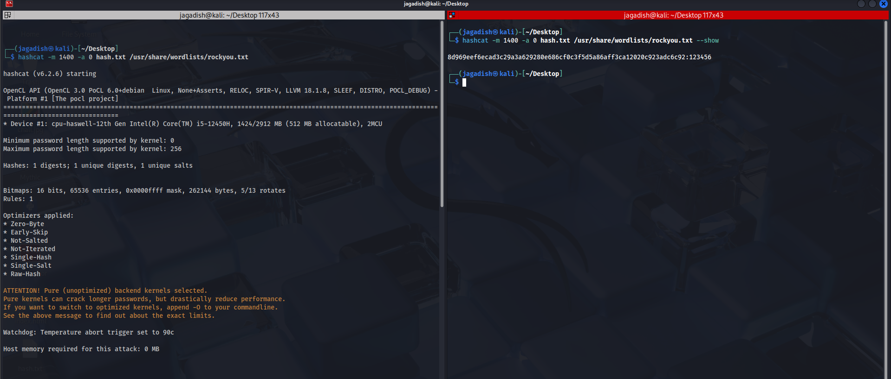
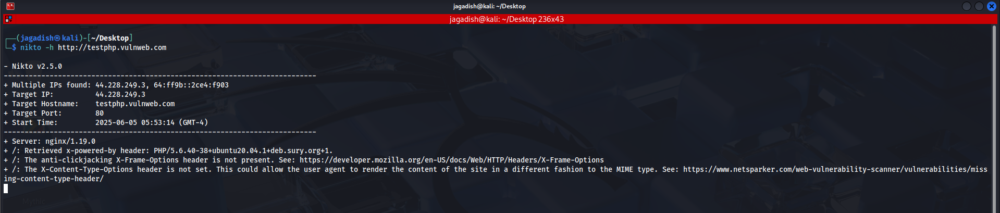

# 🛠️ Useful Linux Security Tools 
This document contains commonly used Linux tools in cybersecurity, with explanations, use-cases, and example commands for beginners.

---

## 1. **nmap** - Network Scanner

- **Purpose:** Scan networks to find live hosts and open ports.
- **Use-case:** To understand the target's network during penetration testing.
- **Basic command:**

```bash
nmap 192.168.34.137  #example
```
This command scans the IP address 192.168.1.1 for open ports.

-   **Advanced example:**

```bash
nmap -sV -p 1-1000 192.168.34.137
```
Here, `-sV` detects service versions and `-p 1-1000` scans ports from 1 to 1000.
* * * * *
2\. **netcat (nc)** - Network Utility
-------------------------------------

-   **Purpose:** Create TCP/UDP connections to send and receive data.

-   **Use-case:** Creating reverse shells, port listening, or simple chat.

-   **Listen on port 4444:**

```bash
nc -lvp 4444
```
-   `-l`: listen mode, `-v`: verbose, `-p`: specify port.

-   **Connect to a host:**

```bash
nc 192.168.1.10 4444
```

* * * * *

3\. **tcpdump** - Packet Sniffer
--------------------------------

-   **Purpose:** Capture and analyze network traffic.

-   **Use-case:** Monitor suspicious network activity.

-   **Basic command:**

```bash
sudo tcpdump -i eth0
```
Captures traffic on the `eth0` interface.

-   **Capture traffic on port 80 only:**

```bash
sudo tcpdump -i eth0 port 80
```
* * * * *

4\. **wireshark** - GUI Network Analyzer
----------------------------------------

-   **Purpose:** Analyze network packets graphically.

-   **Use-case:** Deep inspection of network protocols.

-   **Usage:** Open Wireshark GUI, select an interface, and start capturing.

* * * * *

5\. **curl** - Command Line Data Transfer
-----------------------------------------

-   **Purpose:** Send HTTP requests and fetch web content.

-   **Use-case:** API testing, checking HTTP headers.

-   **Basic command:**

```bash
curl http://example.com
```
-   **View headers only:**
```bash

curl -I http://example.com
```
* * * * *

6\. **wget** - File Downloader
------------------------------

-   **Purpose:** Download files from the web.

-   **Use-case:** Download scripts, tools, or any file.

-   **Basic command:**

```bash
wget http://example.com/file.zip
```
* * * * *

7\. **john (John the Ripper)** - Password Cracker
-------------------------------------------------

-   **Purpose:** Crack password hashes.

-   **Use-case:** Identify weak passwords during security tests.

-   **Basic command:**

```bash
john --wordlist=rockyou.txt hashfile.txt
```
* * * * *

8\. **hydra** - Brute Force Login Tool
--------------------------------------

-   **Purpose:** Perform brute-force attacks on login services.

-   **Use-case:** Test FTP, SSH, HTTP logins.

-   **Basic command:**

```bash
hydra -l admin -P passwords.txt ftp://192.168.1.10
```
* * * * *

9\. **sqlmap** - Automated SQL Injection Tool
---------------------------------------------

-   **Purpose:** Find and exploit SQL injection vulnerabilities.

-   **Use-case:** Test web apps for SQL injection.

-   **Basic command:**

```bash
sqlmap -u "http://target.com/page?id=1" --dbs
```
* * * * *

10\. **gobuster** - Directory/File Brute Forcing
------------------------------------------------

-   **Purpose:** Discover hidden directories and files on websites.

-   **Use-case:** Web reconnaissance.

-   **Basic command:**

```bash
gobuster dir -u http://target.com -w wordlist.txt
```
* * * * *

11\. **hashcat** - Advanced Password Cracker
--------------------------------------------

-   **Purpose:** Crack password hashes using GPU acceleration.

-   **Use-case:** Large scale password cracking.

-   **Basic command:**

```bash
hashcat -m 0 -a 0 hash.txt rockyou.txt
```
* * * * *

12\. **aircrack-ng** - Wireless Network Auditor
-----------------------------------------------

-   **Purpose:** Audit Wi-Fi network security.

-   **Use-case:** Capture packets and crack WEP/WPA keys.

-   **Basic command:**

```bash
airmon-ng start wlan0
```
* * * * *

13\. **nikto** - Web Server Vulnerability Scanner
-------------------------------------------------

-   **Purpose:** Scan web servers for known vulnerabilities.

-   **Use-case:** Test web server security.

-   **Basic command:**

```bash
nikto -h http://target.com
```
